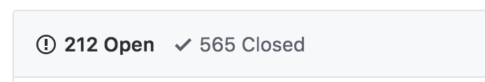

# 考察点
- 开源协议
- 框架依赖
- 组件库大小
- 开发维护及社区状态
- 基本功能及插件功能
- 浏览器兼容性
- 现有的问题
- demo地址


# 编辑器列表
- TinyMce(付费)
- Medium Editor
- Draft.js
- Froala（付费）
- Ckeditor

## TinyMce
### 开源协议
LGPL 2.1 license
允许商业化，但不允许闭源

### 框架依赖
使用方式，引入库，初始化即可
``` js
tinymce.init({
  selector: 'textarea',
  height: 500,
  theme: 'modern',
  plugins: '123',
  toolbar1: 'formatselect | bold italic strikethrough forecolor backcolor | link | alignleft aligncenter alignright alignjustify  | numlist bullist outdent indent  | removeformat',
  image_advtab: true,
  templates: [
    { title: 'Test template 1', content: 'Test 1' },
    { title: 'Test template 2', content: 'Test 2' }
  ],
  content_css: [
    '//fonts.googleapis.com/css?family=Lato:300,300i,400,400i',
    '//www.tinymce.com/css/codepen.min.css'
  ]
 });
```


### 组件库大小
js 418k
[js](https://cloud.tinymce.com/dev/tinymce.min.js?apiKey=qagffr3pkuv17a8on1afax661irst1hbr4e6tbv888sz91jc)

### 开发维护及社区状态


### 基本功能及插件功能
基本功能：加粗、斜体、下划线、链接、有序无序列表、插入图片、插入链接、undo、redo
插件：
Pro版本：$33/M (office张贴、链接检查、@功能)
Developer版本：$10/M

重要性 | 功能(付费版) | 支持情况
---   | ---- | ---
10 | 加粗、斜体、删除、有序、无序列表、redo/undo、H1-H6、下划线、引用、对齐方式 | 支持
10 | 插入删除链接/链接操作 | 支持 
9  |粘贴链接 | 支持
10 | 插入图片/图片操作(左右对齐、删除、大小) | 支持
9  | 图片粘贴 | 支持
10 | 插入表格/表格操作 | 支持
10 | 表格粘贴 | 支持
9  | 自动列表 | 支持
9  | 粘贴word | 支持
8  | mention# | 支持
9  | hashtag# | 不支持
8  | emoji | 不支持
8  | 行内toolbar | 不支持
8  | 区块拖拽 | 支持
6  | 快捷键 | 支持
4  | 特殊字符 | 支持
5  | 全屏 | 支持
3  | 源码编辑 | 支持
2  | 字体、颜色 | 支持
-- | placeholder | 不支持
-- | 多实例 | 支持
-- | 插入时间 | 不支持
-- | 批注 | 不支持


### 浏览器兼容性
chrome+
Firefox+
Edge+
IE11+
safari+

### 现有的问题
### demo地址
[codepen demo](https://codepen.io/tinymce/pen/NGegZK)
[demo](https://s.codepen.io/boomerang/iFrameKey-ed91ba2f-a7e4-d779-4bfd-12e26215b438/index.html)
[官网](https://www.tinymce.com/)

## Medium Editor

### 开源协议
开源
### 框架依赖
引入js、css
``` html
<link rel="stylesheet" href="bower_components/medium-editor/dist/css/medium-editor.css">
<script src="bower_components/medium-editor/dist/js/medium-editor.js"></script>
<div class="editable"></div>
<script type="text/javascript">
var editor = new MediumEditor('.editable');
</script>
```
### 组件库大小
js:338k css:7.6k
[css](https://yabwe.github.io/medium-editor/bower_components/medium-editor/dist/css/medium-editor.css)
[js](https://yabwe.github.io/medium-editor/bower_components/medium-editor/dist/js/medium-editor.js?t=123)
### 开发维护及社区状态




### 基本功能及插件功能
通过选中出现
基本功能：
加粗、斜体、下划线、链接、h1-h6、#功能
插件功能:
图片上传、表格、markdown、自动表格、@、#、自定义toolbar

重要性 | 功能 | 支持情况
---   | ---- | ---
10 | 加粗、斜体、删除、有序、无序列表、redo/undo、H1-H6、下划线、引用、对齐方式 | 支持
10 | 插入删除链接/链接操作 | 插件支持 
9  | 粘贴链接 | 插件支持
10 | 插入图片/图片操作(左右对齐、删除、大小) | 插件支持
9  | 图片粘贴 | 插件支持
10 | 插入表格/表格操作 | 插件支持
10 | 表格粘贴 | 插件支持
9  | 自动列表 | 插件支持
9  | 粘贴word | 插件支持
8  | mention# | 插件支持
9  | hashtag# | 插件支持
8  | emoji | 插件支持
8  | 行内toolbar | 插件支持
8  | 区块拖拽 | 插件支持
6  | 快捷键 | 支持
4  | 特殊字符 | 不支持
5  | 全屏 | 插件支持
3  | 源码编辑 | 支持
2  | 字体、颜色 | 插件支持
-- | placeholder | 不支持
-- | 多实例 | 支持
-- | 插入时间 | 不支持
-- | 批注 | 不支持


### 浏览器兼容性
- chrome+
- Firefox+
- Edge latest+
- IE9+
- safari latest+

### 现有的问题
- autolist不好使
- 现有插件不太好使
- 插件不好扩展

### demo地址
[demo](https://yabwe.github.io/medium-editor/demo.html)
[官网](http://yabwe.github.io/medium-editor/)


## Draft.js
### 开源协议
BSD License 最开放的协议
### 框架依赖
React
### 组件库大小
js：481kb
[js](https://draftjs.org/lib/Draft.js)
### 开发维护及社区状态


### 基本功能及插件功能
社区很强大，插件很丰富 [插件](https://www.draft-js-plugins.com/plugin)

重要性 | 功能 | 支持情况
---   | ---- | ---
10 | 加粗、斜体、删除、有序、无序列表、redo/undo、H1-H6、下划线、引用、对齐方式 | 支持
10 | 插入删除链接/链接操作 | 插件支持 
9  |粘贴链接 | 插件支持
10 | 插入图片/图片操作(左右对齐、删除、大小) | 插件支持
9  | 图片粘贴 | 插件支持
10 | 插入表格/表格操作 | 插件支持
10 | 表格粘贴 | 插件支持
9  | 自动列表 | 插件支持
9  | 粘贴word | 插件支持
8  | mention# | 插件支持
9  | hashtag# | 插件支持
8  | emoji | 插件支持
8  | 行内toolbar | 插件支持
8  | 区块拖拽 | 插件支持
6  | 快捷键 | 支持
4  | 特殊字符 | 不支持
5  | 全屏 | 插件支持
3  | 源码编辑 | 支持
2  | 字体、颜色 | 插件支持
-- | placeholder | 不支持
-- | 多实例 | 支持
-- | 插入时间 | 不支持
-- | 批注 | 不支持

### 浏览器兼容性
手机端基本功能能用
正在向手机端支持靠近，但是没有官方公布支持手机

- chrome+
- Firefox+
- Edge latest+
- IE9+
- safari latest+
- ios safari not fully supported
- chrome for android

### 现有的问题
- 状态更新有延迟
- 用户自定义的osx键绑定
- 浏览器插件，例如语法检查器可能会改变默认的样式，这会导致状态不同步
- IME 和IE11 bug
- 现有的一些高优bug
 
完整版本参考：
https://github.com/facebook/draft-js/blob/master/docs/Advanced-Topics-Issues-and-Pitfalls.md

### demo地址
[demo](https://github.com/nikgraf/awesome-draft-js)


## Froala
### 开源协议
非开源、需购买
### 框架依赖
[vue版本插件](https://www.npmjs.com/package/vue-froala-wysiwyg)

### 组件库大小
基本js:185kb
还有一堆插件
[js](https://github.com/froala/wysiwyg-editor/blob/master/js/froala_editor.min.js)
### 开发维护及社区状态


### 基本功能及插件功能
[插件地址](https://www.froala.com/wysiwyg-editor/docs/plugins)
重要性 | 功能 | 支持情况
---   | ---- | ---
10 | 加粗、斜体、删除、有序、无序列表、redo/undo、H1-H6、下划线、引用、对齐方式 | 支持
10 | 插入删除链接/链接操作 | 支持 
9  | 粘贴链接 | 支持
10 | 插入图片/图片操作(左右对齐、删除、大小) | 支持
9  | 图片粘贴 | 支持
10 | 插入表格/表格操作 | 支持
10 | 表格粘贴 | 支持
9  | 自动列表 | 不支持
9  | 粘贴word | 支持
8  | mention# | 不支持
9  | hashtag# | 不支持
8  | emoji | 支持
8  | 行内toolbar | 不支持
8  | 区块拖拽 | 支持
6  | 快捷键 | 支持
4  | 特殊字符 | 支持
5  | 全屏 | 支持
3  | 源码编辑 | 不支持
2  | 字体、颜色 | 支持
-- | placeholder | 支持
-- | 多实例 | 支持
-- | 插入时间 | 不支持
-- | 批注 | 不支持


### 浏览器兼容性
- Chrome
- Edge
- Firefox
- Safari
- Opera
- Internet Explorer 10+
- Safari iOS
- Chrome, Firefox and Default Browser Android

### 现有的问题
删除卡
连续输入响应慢
失焦

### demo地址
[demo](https://www.froala.com/wysiwyg-editor)


## Ckeditor
### 开源协议
MIT license
### 框架依赖
可直接使用
``` js
CKEDITOR.editorConfig = function( config ) {
    config.language = 'es';
    config.uiColor = '#F7B42C';
    config.height = 300;
    config.toolbarCanCollapse = true;
};
```
### 组件库大小
js大小：549kb
[js](http://nightly.ckeditor.com/17-11-13-07-04/standard/samples/)

### 开发维护及社区状态


### 基本功能及插件功能
基本功能：

重要性 | 功能 | 支持情况
---   | ---- | ---
10 | 加粗、斜体、删除、有序、无序列表、redo/undo、H1-H6、下划线、引用、对齐方式 | 支持
10 | 插入删除链接/链接操作 | 支持 
9  |粘贴链接 | 支持
10 | 插入图片/图片操作(左右对齐、删除、大小) | 支持
9  | 图片粘贴 | 不支持
10 | 插入表格/表格操作 | 支持
10 | 表格粘贴 | 支持
9  | 自动列表 | 不支持
9  | 粘贴word | 支持
8  | mention# | 不支持
9  | hashtag# | 不支持
6  | 快捷键 | 支持
4  | 特殊字符 | 支持
5  | 全屏 | 支持
3  | 源码编辑 | 支持
2  | 字体、颜色 | 不支持
-- | placeholder | 不支持
-- | 多实例 | 支持
-- | 插入时间 | 不支持
-- | 批注 | 不支持

### 浏览器兼容性
[详细参考](https://github.com/ckeditor/ckeditor5-design/wiki/Browser-Compatibility)
- chrome window/mac/linux最新版
- Firefox window/mac/linux最新版
- Edge window 最新版
- IE11+
- safari mac最新版
- 最新版ios safari
- 最新版android chrome
- 最新版windows surface IE


### 现有的问题
### demo地址
[demo](http://nightly.ckeditor.com/17-11-13-07-04/standard/samples/)


## 自己造一个editor
通过contenteditable、execCommand
[问题列表](https://medium.com/content-uneditable/contenteditable-the-good-the-bad-and-the-ugly-261a38555e9c)
问题的冰山一角：
- 如果加粗想要用strong替换b
    + 使用observers，当修改后将html规范化后放入，这种情况要考虑选区的保存、还有undo操作
- 回车创建一个新的行，而不是上一次的默认样式
    + 重新实现execCommand（算法不难，但是浏览器表现都不一样，例如FF有多个选区，实现undo操作）

实际可能：
- delay 几个月
- 不兼容其他浏览器，有些bug可能是浏览器8年的老bug
- 有太多的情况需要考虑到
- 需要支持enter键，同时出来地狱般的粘贴
- 需要处理（Blink/Webkit）回退键、删除键
- 图片支持开发
- selection 具有方向性
- 处理selection系统
- 处理打字、键盘事件、插入特点字符到编辑器
- 处理上下左右导航时的光标


# 结论
如果现成框架为reactjs，用draftjs
如果现成框架为vue，
如果是手机端：可以用draftjs、或者手动开发