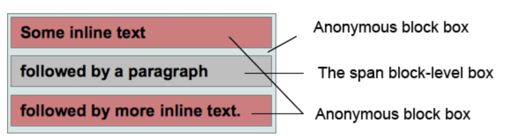

[原文](https://www.w3.org/TR/CSS2/box.html#propdef-margin)
[mdn](https://developer.mozilla.org/en-US/docs/Web/CSS/Visual_formatting_model)
# 8.3 margin塌陷
在css中，相邻两个盒子的margin会合并成一个margin,这种表现方式就叫做margin塌陷
相邻元素就会margin塌陷，除了以下几种情况：
- 根元素的margin不会塌陷
- 
# 9.4章 Normal flow

# visual formatting model(视觉格式化模型)

css visual formatting model是处理文档和在虚拟媒介中显示文档的的一种算法，这个模型是css的基本概念。

visual formatting model会将每个dom元素转换成0到多个盒子,每个盒子的layout由以下因素决定：

- 盒子的尺寸
- 盒子的类型：inline,inline-level,atomic inline-level,block
- position机制（正常文档流、float、absolute定位）
- 它的子节点或者兄弟节点
- viewport的大小和定位
- image元素本来的尺寸
- 其它外部信息

该模型会根据他的containing block的边界来渲染盒子。通常，盒子会为其后代简历containing block。但是盒子不会被他的containing block给限制住，当box的layout超出containing block时，就称之为overflow

## Box generation(盒子生成器)
盒子生成器是视觉格式化模型的一部分，他可以从dom元素创建Box盒子,盒子生成器有很多不同的类型，盒子生成器的类型有css属性 display决定

### Block-level elements and block boxes(块级元素，和块盒子)

当display为block、list-item,table时，这就称之为一个block-level的元素，一个block-level的元素视觉上看起来是一块的，（eg:p元素），这种元素会垂直排列

每一个block-level的元素会参与BFC(block formatting context)。每个block-level的元素会参赛至少一个block-level的盒子，称之为原始的block-level盒子，有些袁术，想list-item的元素，会参数多个盒子，包括他的序号和排版元素。大多数袁术会只产生一个原始的block-level盒子

一个原始的block-level的盒子包含他的子孙节点的盒子和他的content，他也是被包含在[position scheme](https://developer.mozilla.org/en-US/docs/CSS/Positioning_scheme)中的


block-level的盒子也有可能是block containing box,block cotaining box定义：包含其它block-level盒子，或者创建一个IFC(Inline formatting context),也就是值只包含内联原始

block-level主要描述盒子怎么和他的父级及兄弟之前的行为，后者描述盒子和他的子节点的关系。有一些block-level的盒子，例如表格，不是block containing box,相反的有些block container box,像不可替换内联块和不可替换的表格单元，他们就不是block-level的盒子

注：HTML中的、<input>、<textarea>、<select>、<object>都是替换元素。

### Anonymous block boxes(匿名的block盒子)

有些时候我们需要加一些补充的盒子，因为，css 选择器不能给匿名盒子设置样式和名字

选择器对匿名盒子不生效，不能通过css来给他们指定样式，这意味着所有可继承的css属性将是继承的，并且所有不可继承的css属性都有一个initial值

demo1
``` html
<style>
div,p{
    display: block;
}
</style>
<div>Some inline text <p>followed by a paragraph</p> followed by more inline text.</div>
```


demo2
如果一个内联盒子包含一个或多个块状盒子，
``` html
<style>
    p{
        display: inline;
    }
    span{
        display: block;
    }
</style>
<p>Some <em>inline</em> text <span>followed by a paragraph</span> followed by more inline text.</p>
```



### Inline-level elements and inline boxes(内联级别的元素和内联盒子)

display属性是inline,inline-block,inline-table的元素是inline-level的元素。视觉上，他通常是和其它inline-level级别的元素一起分布在多行。典型的，一个p元素包含多个inline-level的em或者img标签。

这张图有些过时了，另外右边黄色区域的内容的定义不是完全与左边相同，也没有比左边的区域大，因为规范上这么说的Inline-level的元素参数inline-level的盒子，这些盒子参与[IFC](https://developer.mozilla.org/en-US/docs/CSS/Inline_formatting_context) (inline formatting context)

inline boxe既是inline-level的盒子，也是box，他们的内容参与他们父级的IFC,例如所有拥有display：inline的不可以替换盒子（例p）。inline-level的盒子有一种盒子他们的内容不会参与IFC,这个称之为atomic inline-level盒子,这种盒子，通过可替换的内联元素产生，或者拥有display为inline-block或者inline-table的元素产生。他们不会被分拆为多个盒子，但是对于inline box来说就是可以的

``` html
<style>
  span {
    display:inline; /* default value*/
  }
</style>
<div style="width:20em;">
   The text in the span <span>can be split in several
   lines as it</span> is an inline box.
</div>
```

这里span就是一个inline box，他会被拆分为多行

``` html
<style>
  span {
    display:inline-block;
  }
</style>
<div style="width:20em;">
   The text in the span <span>cannot be split in several
   lines as it</span> is an inline-block box.
</div>
```

这里span是一个atomic inline-level，他不会被拆分为多行

### 匿名内联盒子

对于块级盒子，有一些情况下内联盒子是css引擎自动创建的，这些内联盒子他们同样不能通过选择器命名，他们继承可继承属性，并设置其他属性为initial


## 其他类型的盒子

### line boxes
Line boxes通过IFC规则来呈现一行text，在一个block boxzhong ,line box会从一边到另一边，当他们是float时，line box从左浮动的最右边开始，从右浮动的最左边开始

### run-in boxes 已经废弃掉

## 定位方案

一旦盒子生成，css引擎需要在layout中定位他们，使用以下规则
-  normal flow： 一个接着一个的排版
-  float： 从normal flow中抽出该盒子，并且将其放在他的containing box的一边
-  absolute 定位：通过他的containing box进行定位，可以覆盖其他元素

### normal flow模式
在正常的文档流中，boxes会一个接着一个的进行定位，在BFC中，他们垂直排列，在IFC中，他们水平排列。position为static或relative的会触发normal flow,并且css的float设置为none

### float定位模式
在float position定位中，这种盒子会定位在当前行的开始或结束位置。这会导致其它normal flow的元素会环绕在他的周围。除非设置了clear属性

当元素的float不是none并且position为static或relative的时候触发float布局，float为left时，定位在line box的左边，float为right时定位在line box的右边

### absolute定位模式
在绝对定位中，该元素已经完全脱离normal flow，并且完全不与之交互，他们会相对于他们containing block进行定位，通过top/bottom/left/right属性

当position设置为absolute或fixed时，他们遵循absolute定位模型

当position设置为fixed时，他的containing block为viewport（视窗大小），定位将相对于viewport来定位，滚动将不会改变他的坐标


# block format context（BFC）

通过以下方式创建：
- 根元素
- float不是none
- postion为absolute 或 fixed
- display为inline-block/table-cell/table-caption/flow-root
- overflow不为visible
- column-span: all
BFC对定位和清除浮动都比较有用，对于定位和清除浮动只会对同一个BFC的元素好使，清除浮动职位清除同一个BFC中的浮动

原文：
In a block formatting context, boxes are laid out one after the other, vertically, beginning at the top of a containing block. The vertical distance between two sibling boxes is determined by the 'margin' properties. Vertical margins between adjacent block-level boxes in a block formatting context collapse.

关键点，两个元素的vertical margin会塌陷，另外包含浮动元素的父元素会高度塌陷


# inline foramt context（IFC）
在IFC,box会水平摆放，从containing block的最上方开始，水平margin、border、padding会插在这些盒子的中间。这些盒子会垂直对齐依赖于不同的方式：bottom、top对齐，或者采用text的baseline对齐。保航这个元素的矩形区域叫做line box

line box的宽度有他的containing block和float来决定，高度由[line height calculations](https://www.w3.org/TR/CSS21/visudet.html#line-height) 决定


