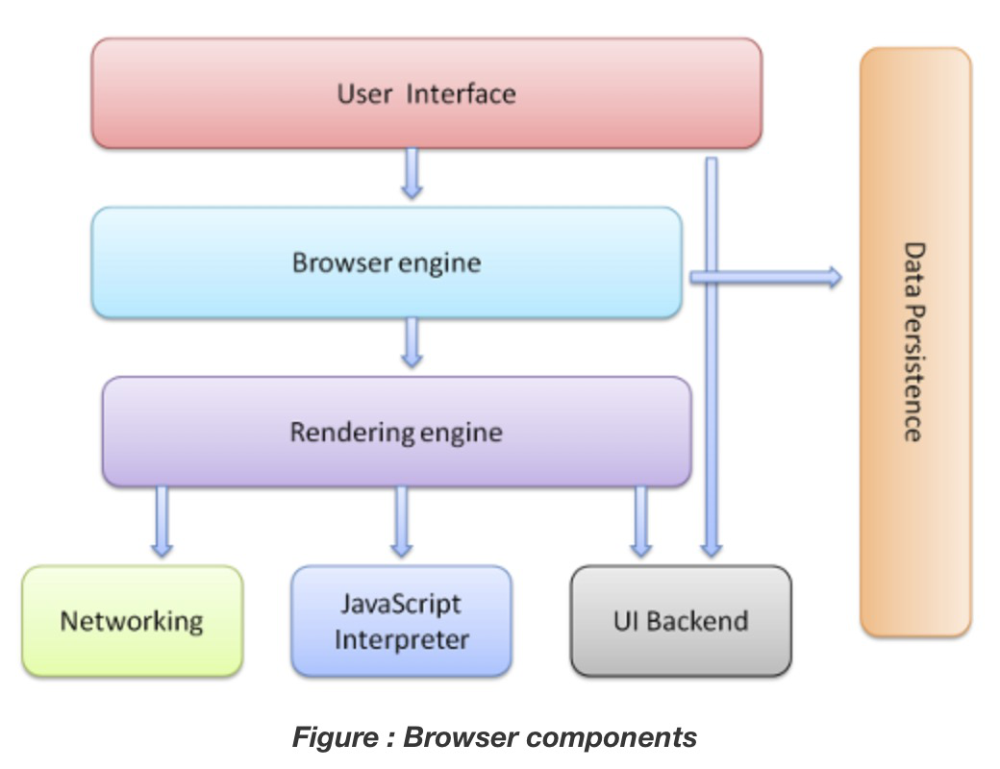
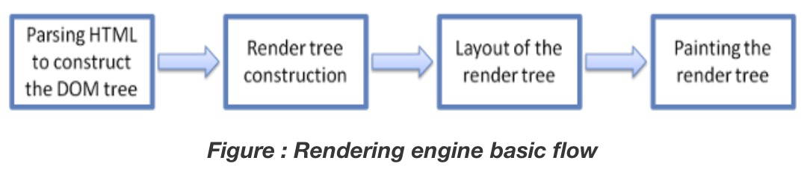
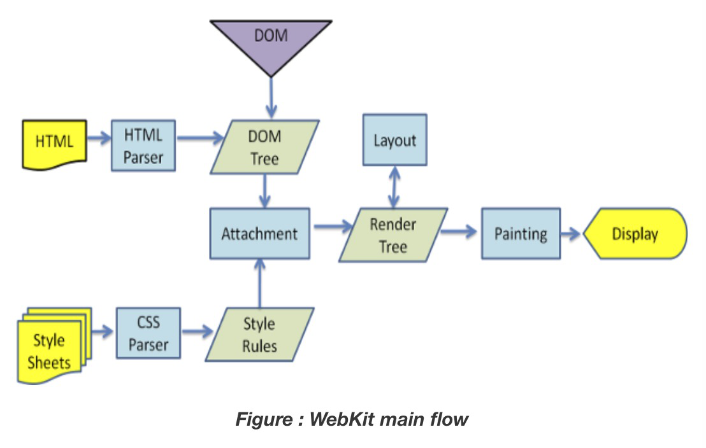
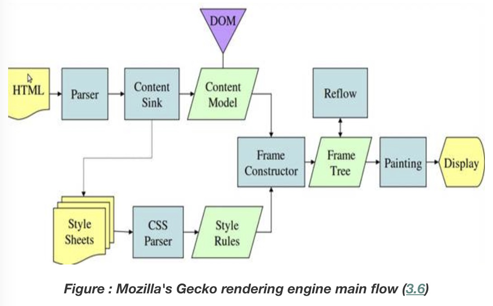

浏览器的主要组件如下图：

- The user interface: this includes the address bar, back/forward button, bookmarking menu, etc. Every part of the browser display except the window where you see the requested page.
- The browser engine: marshals actions between the UI and the rendering engine.
- The rendering engine : responsible for displaying requested content. For example if the requested content is HTML, the rendering engine parses HTML and CSS, and displays the parsed content on the screen.
- Networking: for network calls such as HTTP requests, using different implementations for different platform behind a platform-independent interface.
- UI backend: used for drawing basic widgets like combo boxes and windows. This backend exposes a generic interface that is not platform specific. Underneath it uses operating system user interface methods.
- JavaScript interpreter. Used to parse and execute JavaScript code.
- Data storage. This is a persistence layer. The browser may need to save all sorts of data locally, such as cookies. Browsers also support storage mechanisms such as localStorage, IndexedDB, WebSQL and FileSystem.

chrome会跑多个rendering engine的实例，一个tab一个，每一个tab在一个独立的进程中运行
## Rendering engines
不同浏览器的rendering engines 如下：
- IE(Trident)
- Firefox(Gecko)
- Safari(Webkit)
- Chrome&Opera(Blink, a fork of WebKit)
## The main flow
渲染引擎会先从Networking层拿到请求内容，这个通常是8kb的chunks
这之后便是渲染引擎的一个基本流程

## Main flow examples

两者基本一样，除了叫法不一致，另外一个核心的区别在于Gecko在HTML和DOM tree中间有个层 content sink

## 解析
解析是渲染引擎中非常重要的一环
webkit使用两个非常出名的parser generator，Flex用来创建词法，Bison用来创建解析器，这两个又名（Lex、Yacc）,这两个分别用来进行词法分析和语法分析

### HTML解析
HTML的词法和语法是有w3c定义[specification](https://www.html5rocks.com/en/tutorials/internals/howbrowserswork/#w3c)

很不幸的是大部分传统的parser都没法用于HTML,HTML不容易通过一个上下文无关的语法来定义，而这正是parser需要的

有一个非常正规的格式来定义HTML-DTD,但是这不是上下文无关的语法

> This is a blockquote with two paragraphs. Lorem ipsum dolor sit amet,
consectetuer adipiscing elit. Aliquam hendrerit mi posuere lectus.
Vestibulum enim wisi, viverra nec, fringilla in, laoreet vitae, risus.

[原文](https://www.html5rocks.com/en/tutorials/internals/howbrowserswork/#The_browser_main_functionality)

